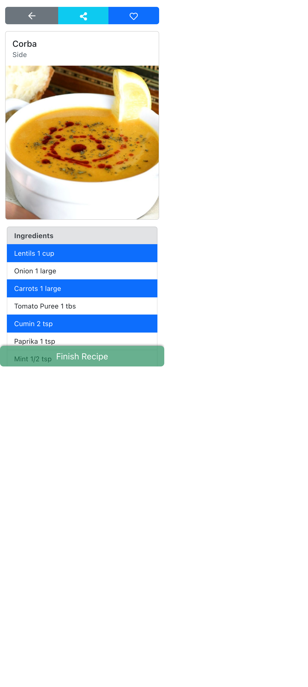
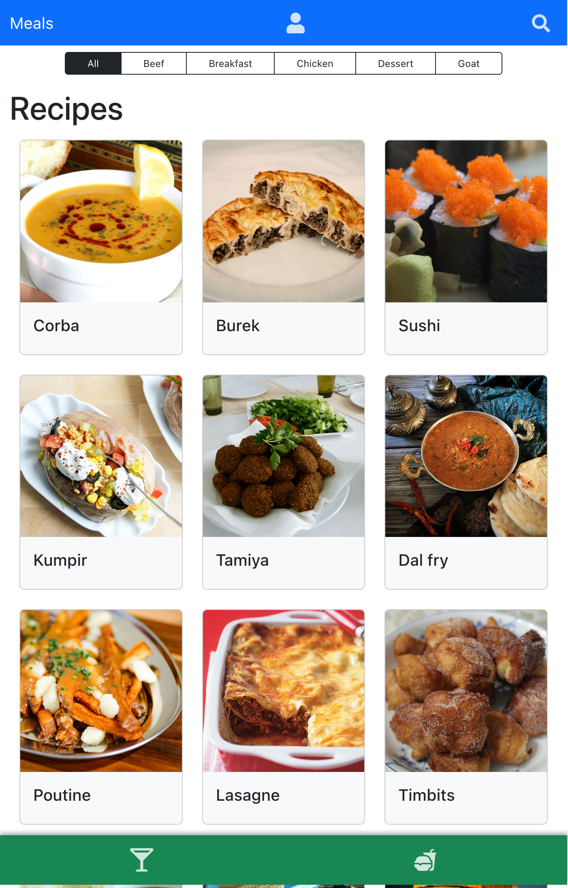

# RecipesApp

A simples Recipe discovery & tracker made with React


## Features

- Search for recipes by name and ingredients needed
- Meals & drinks recipes
- Detailed instructions with video guides
- Save favorite recipes
- Responsive design


## Screenshots






## Demo

[Recipes](https://vrkknn.net/recipes)


## Run Locally

Clone the project

```bash
  git clone https://github.com/Virkkunen/recipes.git
```

Go to the project directory

```bash
  cd recipes
```

Install dependencies

```bash
  npm install
```

Start the server

```bash
  npm start
```


## Authors

- [@Virkkunen](https://www.github.com/Virkkunen)
- [@Mixchelle](https://www.github.com/Mixchelle)
- [@EuJosue](https://www.github.com/EuJosue)
- [@thiagopicorelli](https://www.github.com/thiagopicorelli)
- [@pedropugas](https://www.github.com/pedropugas)
- [@Merkulino](https://www.github.com/Merkulino)


## Tech Stack

React, React hooks, context API, react-bootstrap, react-icons
